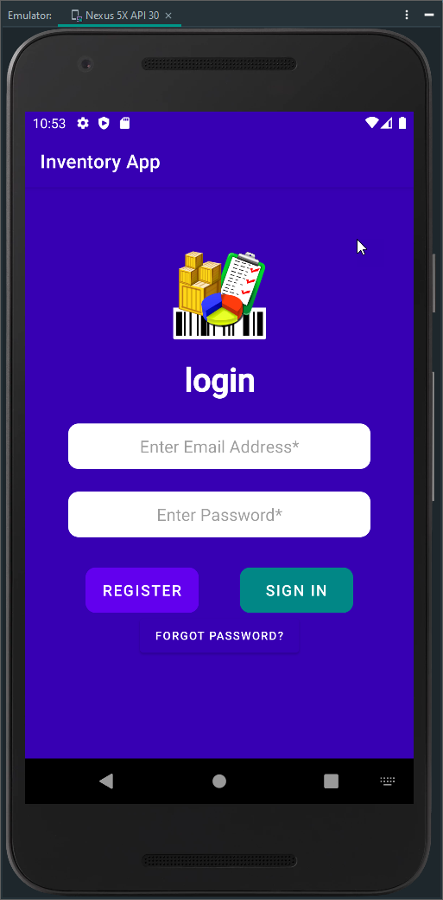
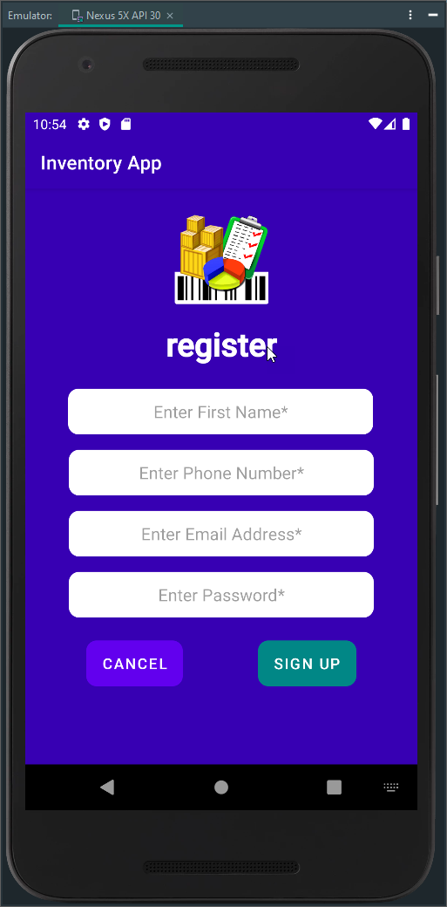
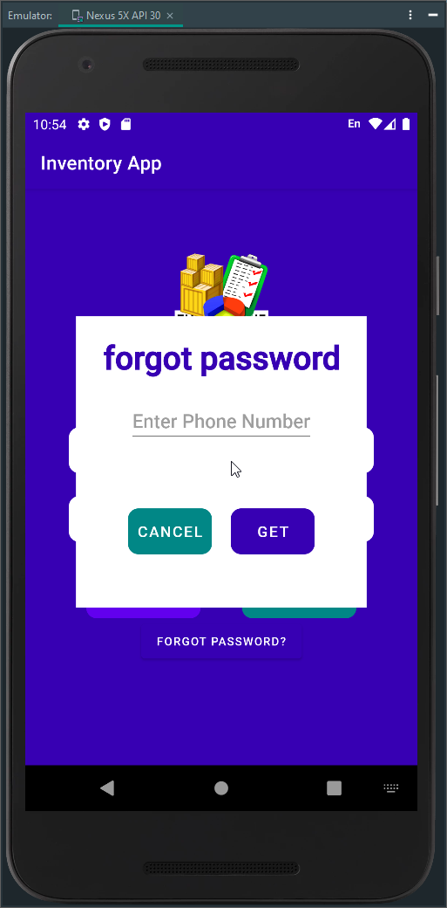
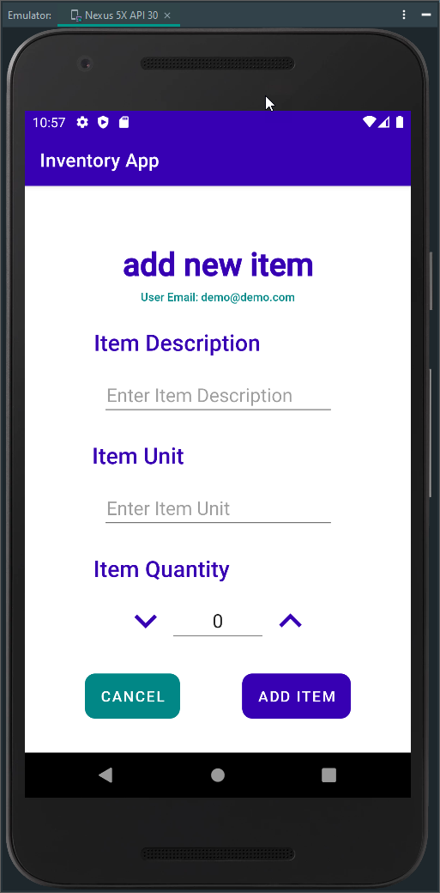
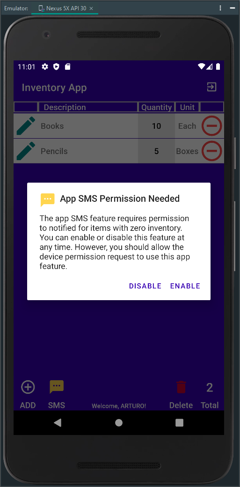
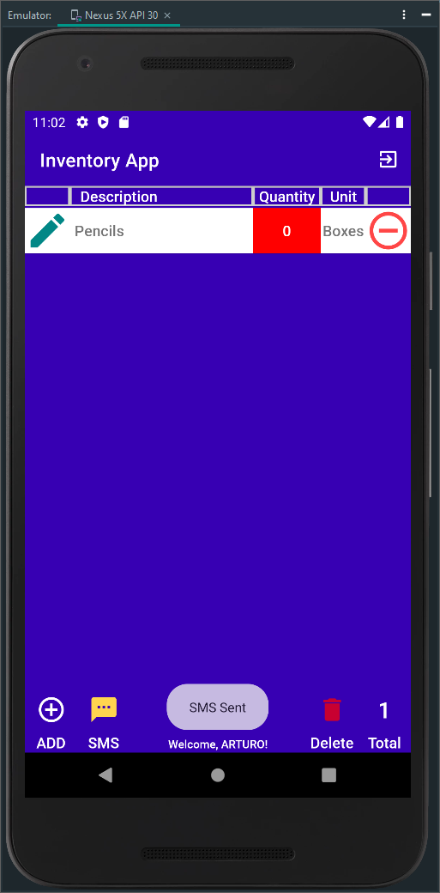
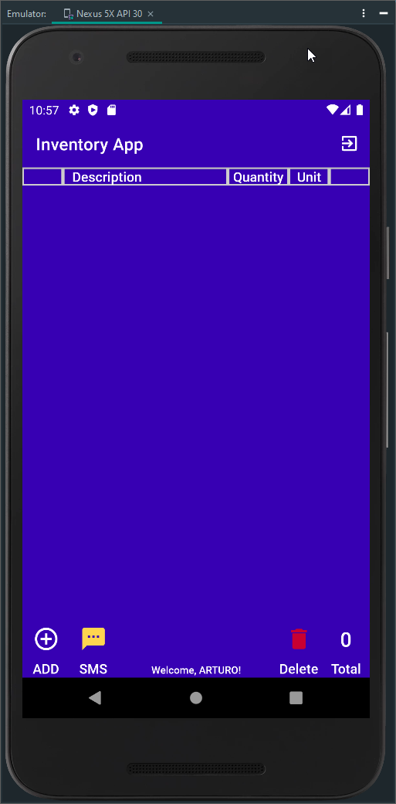

# Inventory App - Android Mobile Application

---

## CS360 Mobile Architect & Programming

---

Overview

I am part of the Mobile2App team, and we were hired to help develop a mobile application called the Inventory App. This app is designed to track items in a warehouse. The project goes through several steps — planning, designing, and developing — and will be ready to launch in the coming weeks.

Our team took time to understand the goals of the app and the needs of the users so we could build the right solution. We meet every week to review client requests, discuss progress, and assign tasks. Throughout the process, we apply good mobile app development principles and best practices.

The Goal:
The Inventory App helps track inventory items through mobile devices. For example, warehouse workers can use the app to manage and automate logistics, which helps the business grow and expand. The app gives users real-time inventory information that can be accessed from anywhere on an Android device.

To meet these goals, the app was requested to include these features:

A database with at least two tables: one for inventory items and one for user logins and passwords.

A sign-in or sign-up screen.

A screen that displays all inventory items in a grid.

A way for users to add and remove items from the inventory.

A way for users to increase or decrease the quantity of specific items.

A notification that alerts users when an item’s quantity reaches zero.

This project shows my ability to design software by understanding user needs and turning those needs into an organized program. It is important to connect the user interface design and layout with the programming part of the app.

As a developer, I start by planning and thinking about the purpose of the app and who will use it. Every group of users is different, so it is important to focus on what they need the most and build those features first. It also helps to look at similar apps to see how they solve similar problems, especially in how they design the user experience. Searching the app store or online for similar apps is a very important step.

There is a lot of information about how to design a good mobile app, and understanding that process is key to making an app that users will like. It is not realistic to think you can make a great app completely on your own. That’s why it is important to work as a team and help each other, from the first planning step to the final launch. Building a strong, collaborative team is essential to follow good practices, improve the design and code, and find new ways to make the app better and meet challenges.

Reflection
This project shows my ability to use solid and creative techniques, skills, and tools in computing to create solutions that deliver real value based on industry needs. The project covered the full process of designing and engineering software, including making sure the app was easy to use and understanding how users would interact with the different screens and actions. I also used standard icons and symbols and designed a database that allows users to create, read, update, and delete inventory data.

I designed and tested solutions to problems by using good algorithms and following computer science standards. I balanced different design choices while thinking about how the algorithms, data structures, classes, methods, and layouts all work together. I also developed a strong security mindset by thinking about possible weaknesses, reducing risks, and protecting data and privacy. I improved security by checking input data and designing with a focus on safety and default protections.

## Screenshots

    
    
    
    
    
    
    
    
    
    
    

---

 )

---

