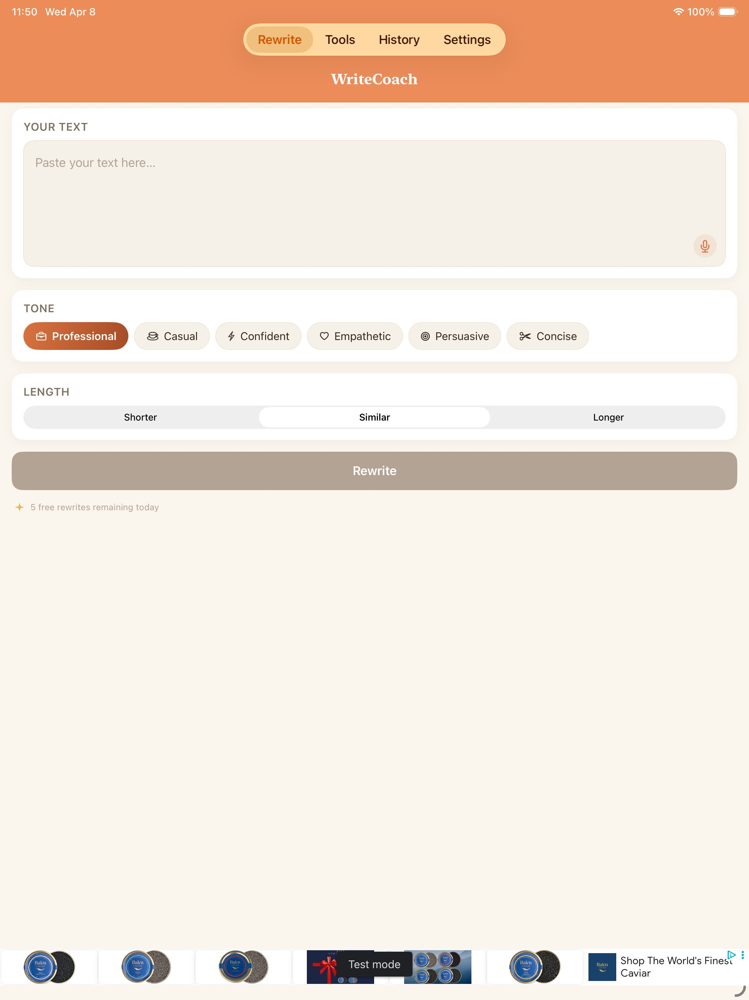

# Quick Image Reference Card

## 🎯 Best Images for Each Use Case

### Hero Section (Portfolio Homepage)
**Show your best work first - iPad screenshots with clear UI:**
```
writecoach/02-rewrite-ipad.png     (Shows 6 tone options - main feature)
neurodecks/01-home-ipad.png        (Shows dashboard with stats)
prepai/04-practice-ipad.png        (Shows interview types - unique feature)
```

### App Store / Marketing
**Highlight subscription value:**
```
writecoach/06-subscription-iphone.png  (Shows pricing clearly)
neurodecks/05-subscription-ipad.png    (Lists all premium features)
prepai/07-subscription-ipad.png        (Shows premium benefits)
```

### Technical Portfolio (GitHub)
**Show AI integration and settings:**
```
writecoach/07-settings-iphone.png  (Multi-AI provider selection)
neurodecks/04-settings-ipad.png    (Shows AI provider options)
prepai/06-settings-ipad.png        (Shows technical configuration)
```

### Blog Posts / Articles
**OnBoarding flows:**
```
writecoach/01-welcome-ipad.png
neurodecks/06-welcome-iphone.png
prepai/01-welcome-ipad.png
```

### Resume / LinkedIn
**Pick 1-2 images per app showing polish:**
```
WriteCoach:   02-rewrite-ipad.png
Neurodecks:   01-home-ipad.png
PrepAI:       04-practice-ipad.png
```

---

## 📱 iPad vs iPhone - When to Use

### Use iPad Screenshots When:
- You need to show detailed UI elements
- Displaying in large format (hero sections, full-width)
- Showing off complex interfaces
- GitHub README (thumbnails need clarity)

### Use iPhone Screenshots When:
- Emphasizing mobile-first design
- Showing responsive layouts
- App Store submission requirements
- Demonstrating portability

---

## 🎨 Image Composition Guide

### Rule of Thirds
Most impactful screenshots follow this order:
1. **Welcome** (sets expectations)
2. **Main Feature** (shows value)
3. **Settings/AI** (shows sophistication)
4. **Premium** (shows monetization)

### For 3-Image Galleries
```
[Welcome]  [Main Feature]  [Premium]
```

### For 6-Image Galleries
```
[Welcome]  [Main Feature]  [Tools/Extra]
[Settings] [iPhone View]   [Premium]
```

---

## 🔥 Most Impressive Screenshots

**Technical Recruiters:**
- `writecoach/07-settings-iphone.png` - Shows multi-AI provider architecture
- `neurodecks/04-settings-ipad.png` - Shows Apple Intelligence integration
- `prepai/04-practice-ipad.png` - Shows interview type complexity

**Design-Focused:**
- `writecoach/02-rewrite-ipad.png` - Clean UI with clear value prop
- `neurodecks/01-home-ipad.png` - Polished dashboard design
- `prepai/02-focus-area-ipad.png` - Professional category selection

**Product Managers:**
- `writecoach/03-tools-ipad.png` - Shows feature breadth
- `neurodecks/05-subscription-ipad.png` - Clear feature differentiation
- `prepai/07-subscription-ipad.png` - Premium value proposition

---

## 💡 Pro Tips

1. **Always use iPad for first impression** - More screen real estate = more impressive
2. **Show iPhone version second** - Proves responsive design
3. **Include at least one subscription screen** - Shows business acumen
4. **Mix light and dark mode** if available - Shows attention to detail
5. **Pair images with short captions** - Explain what they're seeing

---

## 🚀 Copy-Paste Ready Paths

### For Root-Level HTML/Markdown:
```html


```

### For GitHub README.md:
```markdown


```

### For subdirectory (e.g., /docs/):
```html

```

---

## 📊 Image Stats

| App | Total Images | iPad | iPhone | Best Overall |
|-----|--------------|------|--------|--------------|
| WriteCoach | 9 | 4 | 5 | 02-rewrite-ipad.png |
| Neurodecks | 11 | 5 | 6 | 01-home-ipad.png |
| PrepAI | 15 | 7 | 8 | 04-practice-ipad.png |

**Total Portfolio: 35 screenshots**
